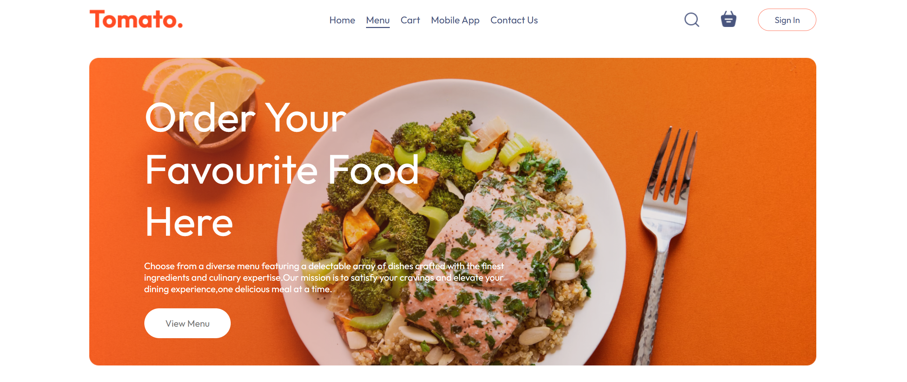
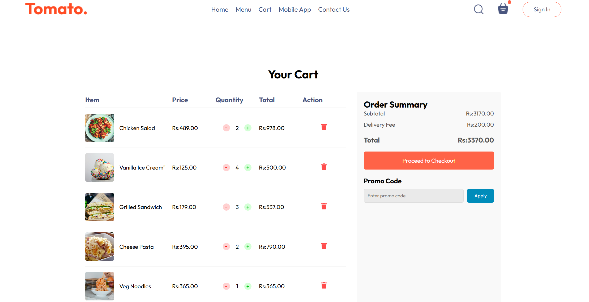
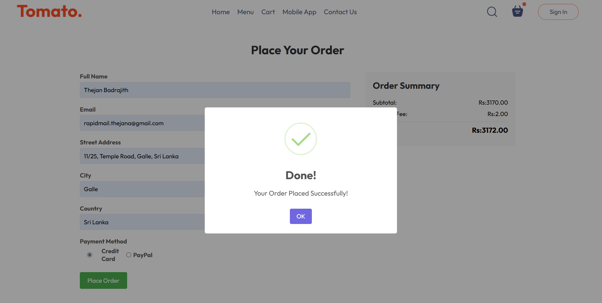
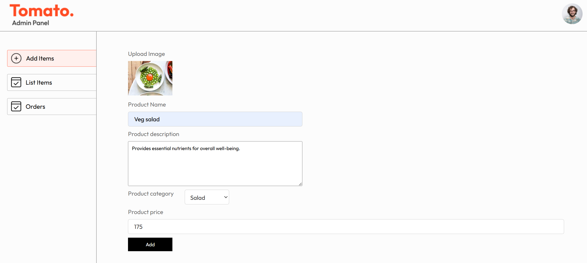
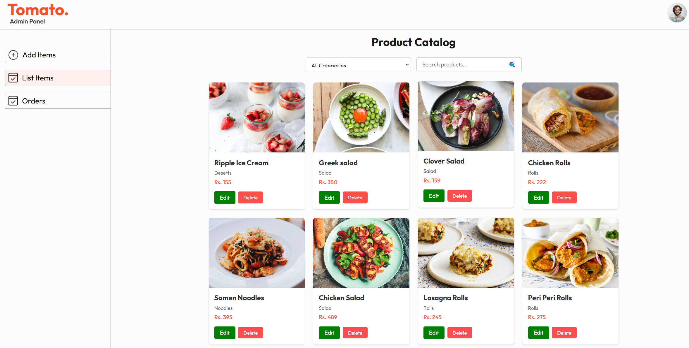
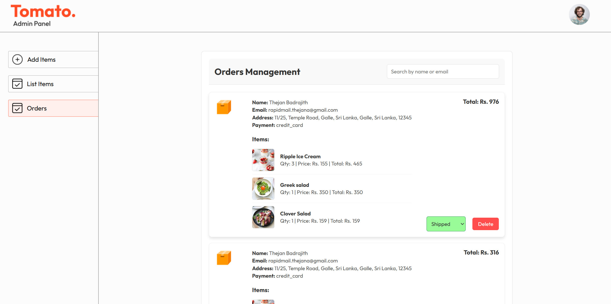

<div align="center">
  <br />
 
  <br />

  <div>
    
    
    
    
    
  </div>

  <h1 align="center">🍴 Restaurant Food Ordering System</h1>
</div>

## 📋 Table of Contents

1. 🍽️ [Introduction](#introduction)
2. ⚙️ [Tech Stack](#tech-stack)
3. 🔋 [Features](#features)
4. 📸 [Screenshots](#screenshots)
5. 🚀 [Getting Started](#getting-started)
6. 📄 [License](#license)
7. 📞 [Contact](#contact)

## 🍽️ Introduction

A web-based restaurant management system that allows customers to browse menus, place orders, and track them in real-time. Administrators can manage inventory, update menu items, and track orders efficiently. Built using React.js, Node.js, Express.js, MongoDB, and Cloudinary.

## ⚙️ Tech Stack

- **Frontend:** React.js
- **Backend:** Node.js, Express.js
- **Database:** MongoDB
- **Storage:** Cloudinary (for image uploads)
- **Authentication:** JWT

## 🔋 Features

👉 **Customer Features:**

- Browse menus and add items to the cart
- Place orders and track them in real-time
- Secure authentication and user profiles

👉 **Admin Features:**

- Manage inventory and menu items
- View, process, and track orders
- Admin dashboard for analytics

👉 **Other Features:**

- Responsive design for all devices
- Secure API endpoints with authentication
- Image storage via Cloudinary

## <a name="screenshots">📸 Screenshots</a>

|                                                    Landing Page                                                     |
| :-----------------------------------------------------------------------------------------------------------------: |
|           |
|                                                      cart Page                                                      |
|                       |
|                                                     Order Page                                                      |
|                |
|                                                 Admin Product Page                                                  |
|    |
|                                                   Admin List Page                                                   |
|  |
|                                                  Admin Orders Page                                                  |
|        |

## 🚀 Getting Started

### Prerequisites

Make sure you have the following installed:

- [Git](https://git-scm.com/)
- [Node.js](https://nodejs.org/en)
- [npm](https://www.npmjs.com/)

### Cloning the Repository

```bash
git clone https://github.com/Govindu-Thejana/Restaurant_Website.git
```

### Installation

Navigate to the project directory and install dependencies:

```bash
cd Restaurant_Website
npm install
```

### Setting Up Environment Variables

Create a `.env` file in the root directory and add the following:

```env
MONGO_URI=your_mongodb_uri
CLOUDINARY_CLOUD_NAME=your_cloudinary_cloud_name
CLOUDINARY_API_KEY=your_cloudinary_api_key
CLOUDINARY_API_SECRET=your_cloudinary_api_secret
```

### Running the Project

Start the backend server:

```bash
npm run server
```

Start the frontend:

```bash
npm start
```

Visit [http://localhost:3000](http://localhost:3000) to use the application.

## 📄 License

This project is licensed under the MIT License.

## 📞 Contact

For any inquiries, feel free to reach out:

- **GitHub:** [Govindu-Thejana](https://github.com/Govindu-Thejana)
- **Email:** govinduthejana@gmail.com
